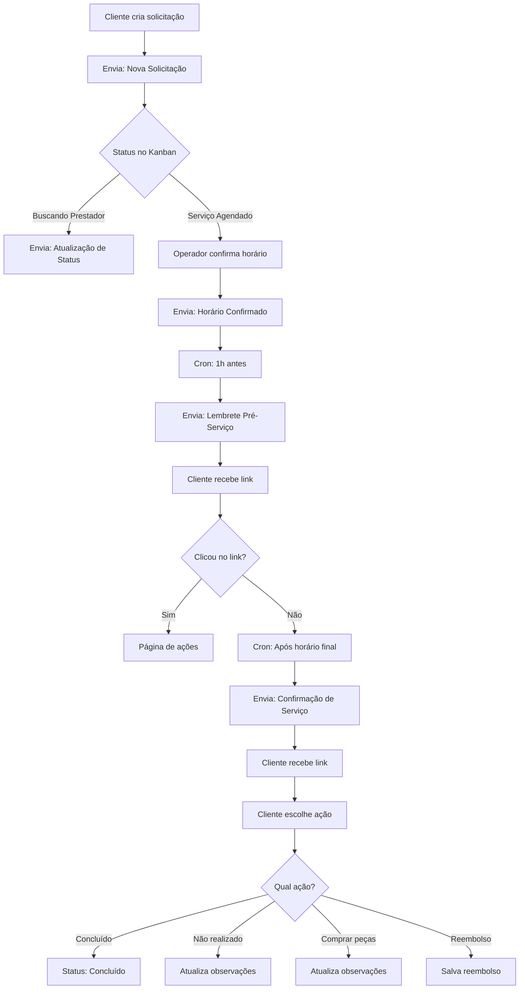
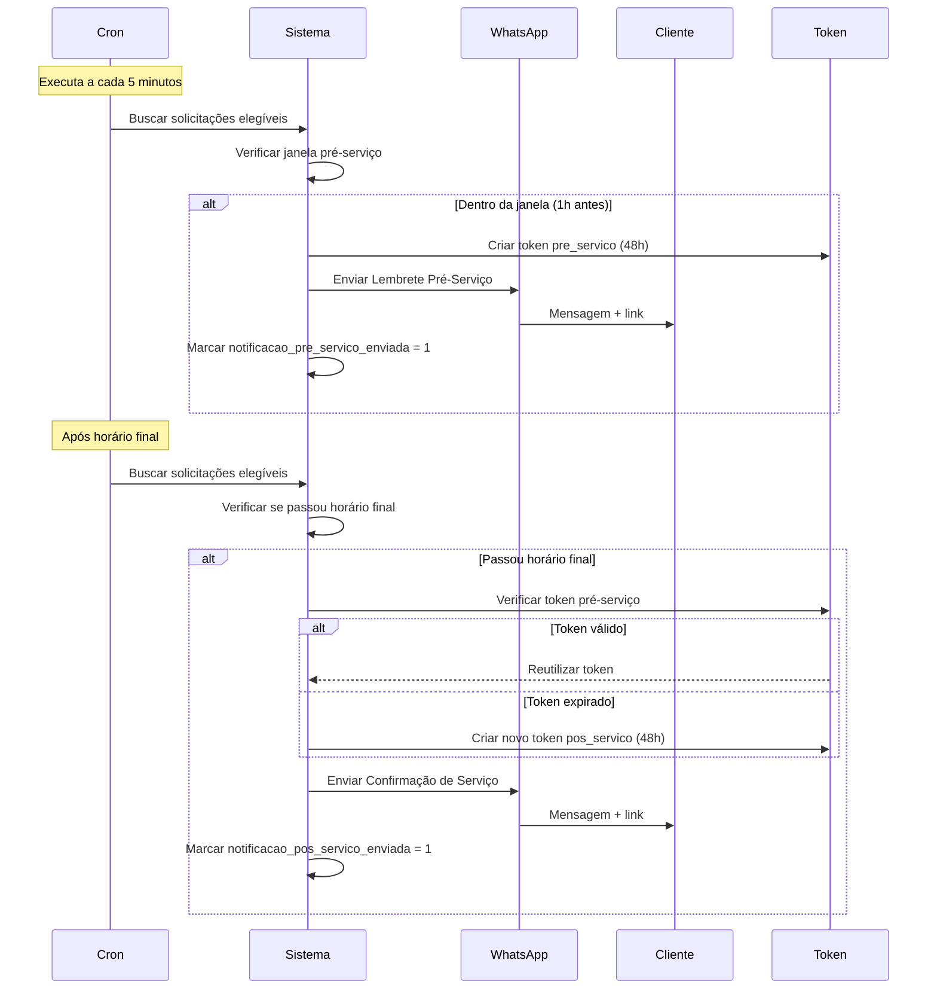
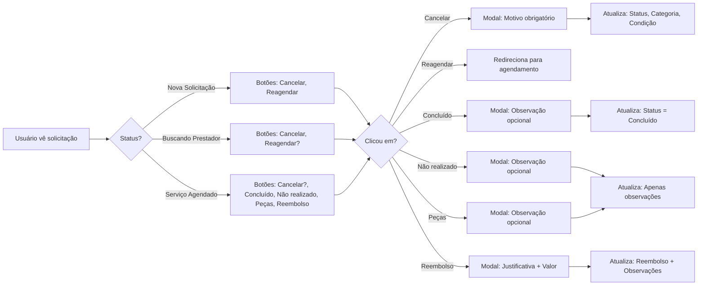

# Documentação Completa - Sistema de Mensagens e Botões

## Visão Geral

Este documento consolida toda a lógica de **envio de mensagens WhatsApp** e **botões do aplicativo** no sistema KSS Assistência 360. Ele serve como referência única para entender:

1. Quando e como as mensagens WhatsApp são enviadas
2. Quando os botões aparecem no aplicativo
3. O que acontece quando o usuário clica em cada botão
4. Como mensagens e botões se integram no fluxo de uma solicitação

---

## Sumário

1. [Visão Geral](#visão-geral)
2. [Mensagens WhatsApp](#mensagens-whatsapp)
   - [2.1 Templates Disponíveis](#21-templates-disponíveis)
   - [2.2 Mensagens Automáticas (Crons)](#22-mensagens-automáticas-crons)
   - [2.3 Mensagens por Eventos](#23-mensagens-por-eventos)
   - [2.4 Configuração de Crons](#24-configuração-de-crons)
3. [Botões do Aplicativo](#botões-do-aplicativo)
   - [3.1 Visão Geral](#31-visão-geral)
   - [3.2 Botões por Status da Solicitação](#32-botões-por-status-da-solicitação)
   - [3.3 Ações dos Botões](#33-ações-dos-botões)
4. [Fluxos Integrados](#fluxos-integrados)
5. [Troubleshooting](#troubleshooting)

---

## Mensagens WhatsApp

### 2.1 Templates Disponíveis

O sistema possui **8 tipos de templates** (alguns implementados, outros pendentes):

| Template | Status | Descrição |
|----------|--------|-----------|
| **Nova Solicitação** | ✅ Implementado | Enviada ao criar solicitação |
| **Horário Confirmado** | ✅ Implementado | Quando horário é confirmado |
| **Horário Sugerido** | ✅ Implementado | Quando operador sugere novos horários |
| **Confirmação de Serviço** | ✅ Implementado | Para confirmar serviço realizado |
| **Atualização de Status** | ✅ Implementado | Quando status muda no Kanban |
| **Lembrete Pré-Serviço** | ✅ Implementado | 1 hora antes do agendamento (via cron) |
| **Lembrete de Peça** | ⚠️ Template pendente | Lembrete para compra de peças |
| **agendado** | ⚠️ Template pendente | Quando datas são confirmadas via Mawdy |
| **concluido** | ⚠️ Template pendente | Quando cliente confirma atendimento |

### Variáveis Disponíveis nos Templates

#### Variáveis de Cliente
- `{{cliente_nome}}` - Nome completo do cliente
- `{{cliente_cpf}}` - CPF do cliente
- `{{cliente_telefone}}` - Telefone do cliente
- `{{cliente_email}}` - E-mail do cliente

#### Variáveis de Solicitação
- `{{protocol}}` - Protocolo/Nº atendimento (ex: KS200)
- `{{contrato_numero}}` - Número do contrato
- `{{protocolo_seguradora}}` - Protocolo da seguradora
- `{{descricao_problema}}` - Descrição do problema
- `{{servico_tipo}}` - Tipo de serviço

#### Variáveis de Endereço
- `{{endereco_completo}}` - Endereço formatado completo
- `{{endereco_rua}}` - Logradouro
- `{{endereco_numero}}` - Número
- `{{endereco_bairro}}` - Bairro
- `{{endereco_cidade}}` - Cidade
- `{{endereco_estado}}` - Estado (UF)
- `{{endereco_cep}}` - CEP

#### Variáveis de Agendamento
- `{{data_agendamento}}` - Data formatada (dd/mm/yyyy)
- `{{horario_agendamento}}` - Horário (ex: 14:00-17:00)
- `{{horario_servico}}` - Data e horário completos
- `{{periodo_chegada}}` - Período de chegada (ex: "08:00 às 11:00")

#### Variáveis de Status
- `{{status_atual}}` - Status atual da solicitação
- `{{prestador_nome}}` - Nome do prestador (se disponível)

#### Variáveis de Links
- `{{link_rastreamento}}` - Link para rastrear solicitação
- `{{link_confirmacao}}` - Link para confirmar horário (com token)
- `{{link_cancelamento}}` - Link para cancelar (com token)
- `{{link_status}}` - Link para atualizar status (com token)
- `{{link_acoes_servico}}` - Link para página de ações (pré/pós-serviço)

---

### 2.2 Mensagens Automáticas (Crons)

#### Pré-Serviço

**Template usado:** `"Lembrete Pré-Serviço"`

**Quando é enviada:**
- **Janela de envio:** Entre 1 hora antes e o horário agendado
- **Frequência:** Executado via cron a cada 5 minutos (recomendado)
- **Condições obrigatórias:**
  - Status = `"Serviço Agendado"`
  - `horario_confirmado = 1`
  - `notificacao_pre_servico_enviada = 0`
  - `data_agendamento IS NOT NULL`
  - `horario_agendamento IS NOT NULL`
  - Dentro da janela de 1 hora antes

**Processo:**
1. Cron executa `processarNotificacoesPreServico()`
2. Busca solicitações elegíveis
3. Para cada solicitação, calcula se está na janela (1h antes até horário agendado)
4. Gera token único (`action_type = 'pre_servico'`, válido por 48h)
5. Envia mensagem WhatsApp com link: `/acoes-servico?token=...`
6. Marca `notificacao_pre_servico_enviada = 1`

**URL do endpoint:**
```
GET /cron/notificacoes-pre-servico
```

**Variáveis especiais:**
- `{{link_acoes_servico}}` - Link para página de ações
- `{{periodo_chegada}}` - Período de chegada (ex: "08:00 às 11:00")

**Arquivo:** `app/Controllers/SolicitacoesController.php` - método `processarNotificacoesPreServico()` (linha ~1185)

---

#### Pós-Serviço

**Template usado:** `"Confirmação de Serviço"`

**Quando é enviada:**
- **Janela de envio:** Após o horário final do agendamento
- **Frequência:** Executado via cron a cada 5 minutos (recomendado)
- **Condições obrigatórias:**
  - Status = `"Serviço Agendado"`
  - `horario_confirmado = 1`
  - `notificacao_pos_servico_enviada = 0`
  - `data_agendamento IS NOT NULL`
  - `horario_agendamento IS NOT NULL`
  - Horário final do agendamento já passou

**Processo:**
1. Cron executa `processarNotificacoesPosServico()`
2. Busca solicitações elegíveis
3. Para cada solicitação, calcula horário final do agendamento
4. Verifica se horário final já passou
5. **Reutiliza token pré-serviço** se ainda válido (dentro de 48h), senão cria novo
6. Envia mensagem WhatsApp com link: `/acoes-servico?token=...`
7. Marca `notificacao_pos_servico_enviada = 1`

**URL do endpoint:**
```
GET /cron/notificacoes-pos-servico
```

**Variáveis especiais:**
- `{{link_acoes_servico}}` - Link para página de ações (mesmo token do pré-serviço se válido)

**Arquivo:** `app/Controllers/SolicitacoesController.php` - método `processarNotificacoesPosServico()` (linha ~1339)

---

#### Lembretes de Peça

**Template usado:** `"lembrete_peca"` (⚠️ **Template pendente** - precisa ser criado)

**Quando é enviada:**
- **Frequência:** A cada 1 dia para solicitações elegíveis
- **Condições obrigatórias:**
  - Status = `"Aguardando Peça"`
  - `data_limite_peca IS NOT NULL` (prazo de 10 dias)
  - `data_ultimo_lembrete IS NULL` OU `data_ultimo_lembrete < DATE_SUB(NOW(), INTERVAL 1 DAY)`
  - Não expirou o prazo (hoje <= `data_limite_peca`)

**Processo:**
1. Cron executa `processarLembretesPeca()`
2. Busca solicitações elegíveis via `getSolicitacoesParaLembrete()`
3. Para cada solicitação:
   - Verifica se ainda está dentro do prazo (10 dias)
   - Calcula dias restantes
   - Envia mensagem WhatsApp
   - Atualiza `data_ultimo_lembrete = NOW()` e incrementa `lembretes_enviados`

**URL do endpoint:**
```
GET /cron/lembretes-peca
```

**Variáveis especiais:**
- `{{dias_restantes}}` - Dias restantes até o limite
- `{{data_limite}}` - Data limite formatada (dd/mm/yyyy)

**Arquivo:** `app/Controllers/SolicitacoesController.php` - método `processarLembretesPeca()` (linha ~1568)

---

### 2.3 Mensagens por Eventos

#### 1. Nova Solicitação

**Template:** `"Nova Solicitação"`

**Quando é enviada:**
- Imediatamente após criar uma solicitação no banco de dados
- Tanto para solicitações normais quanto manuais migradas

**Método:** `SolicitacoesController::criarSolicitacao()`

**Variáveis principais:**
- `{{protocol}}`
- `{{cliente_nome}}`
- `{{endereco_completo}}`
- `{{descricao_problema}}`
- `{{link_rastreamento}}`

**Token gerado:** ❌ Não

---

#### 2. Horário Confirmado

**Template:** `"Horário Confirmado"`

**Quando é enviada:**
- Quando o operador confirma um horário de atendimento
- **IMPORTANTE:** Só envia se o status for `"Serviço Agendado"`

**Métodos:**
- `SolicitacoesController::confirmarHorario()`
- `SolicitacoesController::atualizarDetalhes()` (quando status é "Serviço Agendado" e há horários confirmados)

**Variáveis principais:**
- `{{data_agendamento}}`
- `{{horario_agendamento}}`
- `{{link_cancelamento}}`

**Token gerado:** ✅ Sim (válido por 48h, `action_type = 'confirm'`)

---

#### 3. Horário Sugerido

**Template:** `"Horário Sugerido"`

**Quando é enviada:**
- Quando o operador solicita novos horários (horários originais indisponíveis)
- Quando adiciona horários no sistema e status **NÃO** é "Serviço Agendado"

**Método:** `SolicitacoesController::solicitarNovosHorarios()`

**Variáveis principais:**
- `{{data_agendamento}}` (pode ser "A definir")
- `{{horario_agendamento}}` (pode ser "Aguardando novas opções")
- `{{link_confirmacao}}`

**Token gerado:** ✅ Sim (válido por 48h, `action_type = 'reschedule'`)

---

#### 4. Confirmação de Serviço

**Template:** `"Confirmação de Serviço"`

**Quando é enviada:**
- Quando o operador registra a confirmação do serviço realizado
- Também enviada via cron pós-serviço (após horário final)

**Método:** `SolicitacoesController::confirmarServico()`

**Variáveis principais:**
- `{{horario_servico}}`
- `{{link_status}}`
- `{{link_acoes_servico}}` (no caso do cron)

**Token gerado:** ✅ Sim (válido por 48h, `action_type = 'service_status'`)

---

#### 5. Atualização de Status

**Template:** `"Atualização de Status"`

**Quando é enviada:**
- Sempre que o operador arrasta um card para outra coluna no Kanban
- Quando o status da solicitação é alterado

**Método:** `SolicitacoesController::updateStatus()`

**Variáveis principais:**
- `{{status_atual}}`
- `{{prestador_nome}}` (se disponível)
- `{{data_agendamento}}` (se disponível)
- `{{horario_agendamento}}` (se disponível)
- `{{link_rastreamento}}`

**Token gerado:** ❌ Não

---

### 2.4 Configuração de Crons

#### URLs dos Endpoints

```
GET /cron/notificacoes-pre-servico
GET /cron/notificacoes-pos-servico
GET /cron/lembretes-peca
```

**Proteção:** Os endpoints são públicos (sem autenticação). Recomenda-se proteger via servidor (ex: .htaccess ou nginx).

#### Frequência Recomendada

- **Mínimo:** A cada 5 minutos
- **Ideal:** A cada 1-2 minutos (mais preciso, mas mais carga no servidor)

#### Configuração no Crontab

```bash
# Executar a cada 5 minutos
*/5 * * * * curl -s "https://seu-dominio.com/cron/notificacoes-pre-servico" > /dev/null 2>&1
*/5 * * * * curl -s "https://seu-dominio.com/cron/notificacoes-pos-servico" > /dev/null 2>&1
*/5 * * * * curl -s "https://seu-dominio.com/cron/lembretes-peca" > /dev/null 2>&1
```

#### Resposta Esperada

```json
{
  "success": true,
  "message": "Notificações pré-serviço processadas",
  "enviadas": 2,
  "total_verificadas": 5,
  "timestamp": "2025-12-10 14:30:00"
}
```

---

## Botões do Aplicativo

### 3.1 Visão Geral

Os botões aparecem na página de visualização de solicitação:
- **Usuário logado:** `app/Views/locatario/show-solicitacao.php`
- **Acesso público (token):** `app/Views/locatario/rastreamento-publico.php`

**Controles de acesso:**
- Botões funcionam tanto para usuários logados quanto para acesso via token público
- Endpoints:
  - Logado: `/{instancia}/solicitacoes/{id}/executar-acao`
  - Token: `/rastreamento/{token}/acao`

**Processamento:** Métodos `executarAcao()` e `executarAcaoComToken()` em `LocatarioController.php`

---

### 3.2 Botões por Status da Solicitação

#### Status: "Nova Solicitação"

**Botões disponíveis:**
- ✅ **Cancelar** - Sempre visível
- ✅ **Reagendar** - Sempre visível

**Condições:** Sempre aparecem (sem validações adicionais)

---

#### Status: "Buscando Prestador" / "Aguardando Prestador"

**Botões disponíveis:**
- ✅ **Cancelar** - Sempre visível
- ✅ **Reagendar** - Apenas se condição contém "reagendar" no nome

**Condições:**
- Cancelar: Sempre aparece
- Reagendar: Só aparece se `condicao_nome` contém "reagendar" (case-insensitive)

**Arquivo:** `app/Views/locatario/show-solicitacao.php` (linha ~90-115)

---

#### Status: "Serviço Agendado"

**Botões disponíveis:**
- ⚠️ **Cancelar** - Apenas até 1 dia antes do agendamento
- ✅ **Concluído** - Sempre visível
- ✅ **Serviço não realizado** - Sempre visível
- ✅ **Comprar peças** - Sempre visível
- ✅ **Reembolso** - Sempre visível

**Condições:**
- Cancelar: Só aparece se `data_agendamento >= hoje + 1 dia`
- Demais botões: Sempre aparecem

**Cálculo do "podeCancelar":**
```php
$dataAgendamentoObj = new \DateTime($dataAgendamento);
$hoje = new \DateTime();
$diferenca = $hoje->diff($dataAgendamentoObj);
$podeCancelar = $diferenca->days >= 1 && $dataAgendamentoObj > $hoje;
```

**Arquivo:** `app/Views/locatario/show-solicitacao.php` (linha ~116-156)

---

### 3.3 Ações dos Botões

#### Botão: Cancelar

**Modal:** `modalCancelando`

**Campos obrigatórios:**
- ✅ Observação (texto)

**Campos opcionais:**
- Anexos (imagens, PDF, Word) - múltiplos arquivos

**Processamento:**
1. Valida observação obrigatória
2. Processa upload de anexos (se houver)
3. Busca status "Cancelado" ou "Cancelada"
4. Busca categoria "Cancelado" (qualquer categoria com "Cancelado" no nome)
5. Busca condição "Cancelado pelo Locatário" (qualquer condição com "Cancelado" no nome)
6. Atualiza solicitação:
   - `status_id` = Status "Cancelado"
   - `categoria_id` = Categoria "Cancelado"
   - `condicao_id` = Condição "Cancelado pelo Locatário"
   - `observacoes` = Observação anterior + "[Cancelado em {timestamp}] Motivo: {observacao}"
   - `motivo_cancelamento` = Observação do usuário
7. Registra no histórico de status

**Arquivo:** `app/Controllers/LocatarioController.php` - método `executarAcao()` (linha ~2622-2696)

---

#### Botão: Concluído

**Modal:** `modalConcluido`

**Campos obrigatórios:**
- ❌ Nenhum

**Campos opcionais:**
- Observação (texto)
- Anexos (imagens, PDF, Word) - múltiplos arquivos

**Processamento:**
1. Busca status "Concluído" ou "Concluido"
2. Processa upload de anexos (se houver)
3. Atualiza solicitação:
   - `status_id` = Status "Concluído"
   - `observacoes` = Observação anterior + "[Concluído em {timestamp}] Observação do locatário: {observacao}" (ou sem observação se vazia)
4. Não registra histórico adicional (apenas update)

**Arquivo:** `app/Controllers/LocatarioController.php` - método `executarAcao()` (linha ~2596-2621)

---

#### Botão: Serviço não realizado

**Modal:** `modalServicoNaoRealizado`

**Campos obrigatórios:**
- ❌ Nenhum

**Campos opcionais:**
- Observação (texto)
- Anexos (imagens, PDF, Word) - múltiplos arquivos

**Processamento:**
1. Processa upload de anexos (se houver)
2. Atualiza solicitação:
   - `observacoes` = Observação anterior + "[Serviço não realizado em {timestamp}] Observação: {observacao}" (ou sem observação se vazia)
3. **NÃO muda status** (permanece "Serviço Agendado")
4. Não registra histórico

**Observação importante:** Este botão apenas registra a informação nas observações. O operador do sistema deve avaliar o motivo e tomar as ações necessárias (ex: reagendar, cancelar, ou tomar outras medidas).

**Arquivo:** `app/Controllers/LocatarioController.php` - método `executarAcao()` (linha ~2698-2711)

---

#### Botão: Comprar peças

**Modal:** `modalComprarPecas`

**Campos obrigatórios:**
- ❌ Nenhum

**Campos opcionais:**
- Observação (texto)
- Anexos (imagens, PDF, Word) - múltiplos arquivos

**Processamento:**
1. Processa upload de anexos (se houver)
2. Atualiza solicitação:
   - `observacoes` = Observação anterior + "[Comprar peças em {timestamp}] Observação: {observacao}" (ou sem observação se vazia)
3. **NÃO muda status**
4. Não registra histórico

**Arquivo:** `app/Controllers/LocatarioController.php` - método `executarAcao()` (linha ~2713-2726)

---

#### Botão: Reembolso

**Modal:** `modalReembolso`

**Campos obrigatórios:**
- ✅ Justificativa (texto)
- ✅ Valor do reembolso (numérico > 0)

**Campos opcionais:**
- Anexos (imagens, PDF, Word) - múltiplos arquivos

**Processamento:**
1. Valida justificativa obrigatória
2. Valida valor obrigatório (> 0)
3. Processa upload de anexos (se houver)
4. Atualiza solicitação:
   - `observacoes` = Observação anterior + "[Reembolso solicitado em {timestamp}] Justificativa: {justificativa} Valor solicitado: R$ {valor}"
   - `precisa_reembolso` = 1
   - `valor_reembolso` = Valor informado
5. **NÃO muda status**
6. Não registra histórico

**Arquivo:** `app/Controllers/LocatarioController.php` - método `executarAcao()` (linha ~2728-2751)

---

#### Botão: Reagendar

**Modal:** `modalReagendar`

**Campos:** Nenhum (apenas confirmação)

**Processamento:**
1. Redireciona para página de agendamento (`/{instancia}/nova-solicitacao`)
2. Não altera dados da solicitação atual

**Arquivo:** `app/Views/locatario/show-solicitacao.php` - JavaScript `confirmarReagendar()` (linha ~572-586)

---

### Regras de Upload de Anexos

**Tipos permitidos:**
- Imagens: `image/jpeg`, `image/png`, `image/gif`, `image/webp`
- Documentos: `application/pdf`, `application/msword`, `application/vnd.openxmlformats-officedocument.wordprocessingml.document`

**Tamanho máximo:** 10MB por arquivo

**Localização:** `Public/uploads/solicitacoes/{solicitacao_id}/anexos/`

**Processamento:** Método `processarUploadAnexos()` em `LocatarioController.php` (linha ~2767-2804)

---

## Fluxos Integrados

### Fluxo Completo: Nova Solicitação até Conclusão



---

### Fluxo: Pré-Serviço e Pós-Serviço



---

### Fluxo: Botões e Ações



---

## Troubleshooting

### Problemas com Mensagens WhatsApp

#### Mensagens não são enviadas

**Checklist:**
1. Verificar se `WHATSAPP_ENABLED=true` no `.env`
2. Conferir credenciais: `WHATSAPP_API_URL`, `WHATSAPP_API_KEY`, `WHATSAPP_INSTANCE`, `WHATSAPP_TOKEN`
3. Verificar se o template está ativo: `SELECT * FROM whatsapp_templates WHERE tipo = ? AND ativo = 1`
4. Testar Evolution API diretamente via cURL
5. Verificar logs de erro do PHP (`storage/logs/app.log`)

**Query de verificação:**
```sql
-- Verificar solicitações elegíveis para pré-serviço
SELECT s.id, s.numero_solicitacao, s.data_agendamento, s.horario_agendamento,
       s.horario_confirmado, s.notificacao_pre_servico_enviada, 
       st.nome as status_nome
FROM solicitacoes s
INNER JOIN status st ON s.status_id = st.id
WHERE st.nome = 'Serviço Agendado'
AND s.horario_confirmado = 1
AND s.notificacao_pre_servico_enviada = 0
AND s.data_agendamento IS NOT NULL
AND s.horario_agendamento IS NOT NULL;
```

---

#### Crons não estão executando

**Verificações:**
1. Testar endpoints manualmente:
   - `https://seu-dominio.com/cron/notificacoes-pre-servico`
   - `https://seu-dominio.com/cron/notificacoes-pos-servico`
   - `https://seu-dominio.com/cron/lembretes-peca`

2. Verificar logs do cron:
   ```bash
   tail -f /var/log/kss_cron.log
   ```

3. Verificar se crons estão configurados no servidor:
   ```bash
   crontab -l
   ```

4. Verificar se há solicitações elegíveis (queries acima)

---

#### Variáveis não são substituídas

**Causa:** Variável não existe no template ou dados faltando na solicitação

**Solução:**
1. Verificar se variável está no template: `{{variavel}}` (com chaves duplas)
2. Verificar se dados existem na solicitação
3. Verificar logs de erro

**Exemplo correto:**
```
Olá {{cliente_nome}}, seu protocolo é {{protocol}}.
```

---

### Problemas com Botões

#### Botão não aparece

**Verificações:**

1. **Cancelar (Status: Serviço Agendado):**
   - Verificar se `data_agendamento >= hoje + 1 dia`
   - Query: `SELECT DATEDIFF(data_agendamento, NOW()) as dias_restantes FROM solicitacoes WHERE id = ?`

2. **Reagendar (Status: Buscando Prestador):**
   - Verificar se condição contém "reagendar": `SELECT condicao_nome FROM solicitacoes s INNER JOIN condicoes c ON s.condicao_id = c.id WHERE s.id = ?`

3. **Demais botões:**
   - Verificar se status está correto
   - Verificar se usuário tem permissão (logado ou token válido)

---

#### Botão não funciona ao clicar

**Verificações:**

1. **Erro 404:** Verificar se rota existe em `app/Config/routes.php`
   - Logado: `/{instancia}/solicitacoes/{id}/executar-acao`
   - Token: `/rastreamento/{token}/acao`

2. **Erro 403:** Verificar autenticação/token
   - Token válido? `SELECT * FROM solicitacoes WHERE token_acesso = ?`
   - Usuário logado? Verificar sessão

3. **Erro 500:** Verificar logs em `storage/logs/app.log`

4. **Validação falha:** Verificar campos obrigatórios
   - Cancelar: Observação obrigatória
   - Reembolso: Justificativa e valor obrigatórios

---

#### Upload de anexos não funciona

**Verificações:**

1. **Tamanho:** Verificar se arquivo <= 10MB
2. **Tipo:** Verificar se tipo é permitido (JPEG, PNG, GIF, WebP, PDF, Word)
3. **Permissões:** Verificar se diretório `Public/uploads/solicitacoes/` tem permissão de escrita (775 ou 755)
4. **Espaço em disco:** Verificar espaço disponível no servidor

---

## Referências de Arquivos

### Controllers
- `app/Controllers/SolicitacoesController.php` - Métodos de mensagens e crons
- `app/Controllers/LocatarioController.php` - Métodos de ações dos botões

### Views
- `app/Views/locatario/show-solicitacao.php` - Página de solicitação (usuário logado)
- `app/Views/locatario/rastreamento-publico.php` - Página de solicitação (acesso público)

### Services
- `app/Services/WhatsAppService.php` - Lógica de envio de mensagens

### Models
- `app/Models/Solicitacao.php` - Model de solicitações
- `app/Models/ScheduleConfirmationToken.php` - Model de tokens

### Rotas
- `app/Config/routes.php` - Definição de rotas

---

## Resumo Rápido

### Mensagens WhatsApp - Resumo

| Tipo | Quando Envia | Template | Token | Cron |
|------|--------------|----------|-------|------|
| Nova Solicitação | Ao criar solicitação | ✅ Sim | ❌ | ❌ |
| Horário Confirmado | Ao confirmar horário | ✅ Sim | ✅ (48h) | ❌ |
| Horário Sugerido | Ao sugerir horários | ✅ Sim | ✅ (48h) | ❌ |
| Confirmação de Serviço | Após confirmar serviço | ✅ Sim | ✅ (48h) | ❌ |
| Atualização de Status | Ao mudar status | ✅ Sim | ❌ | ❌ |
| Lembrete Pré-Serviço | 1h antes do agendamento | ✅ Sim | ✅ (48h) | ✅ (5min) |
| Lembrete Pós-Serviço | Após horário final | ✅ Sim | ✅ (48h) | ✅ (5min) |
| Lembrete de Peça | A cada 1 dia | ⚠️ Pendente | ❌ | ✅ (5min) |

### Botões - Resumo por Status

| Status | Botões Disponíveis |
|--------|-------------------|
| Nova Solicitação | Cancelar, Reagendar |
| Buscando Prestador | Cancelar, Reagendar (se condição permitir) |
| Serviço Agendado | Cancelar (até 1 dia antes), Concluído, Não realizado, Peças, Reembolso |

### Ações dos Botões - Resumo

| Botão | Muda Status? | Campos Obrigatórios | Histórico? |
|-------|--------------|-------------------|------------|
| Cancelar | ✅ Sim (Cancelado) | Observação | ✅ Sim |
| Reagendar | ❌ Não | Nenhum | ❌ Não |
| Concluído | ✅ Sim (Concluído) | Nenhum | ❌ Não |
| Não realizado | ❌ Não | Nenhum | ❌ Não |
| Comprar peças | ❌ Não | Nenhum | ❌ Não |
| Reembolso | ❌ Não | Justificativa + Valor | ❌ Não |

---

**Última atualização:** Dezembro 2025  
**Versão:** 1.0.0

